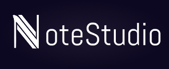
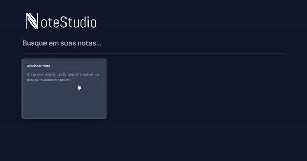
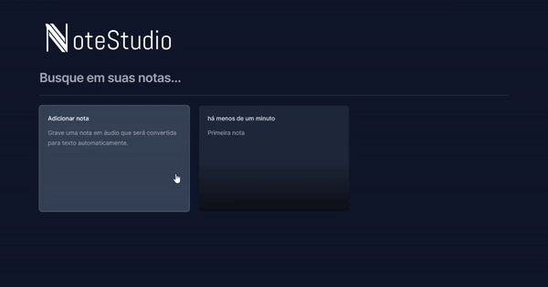
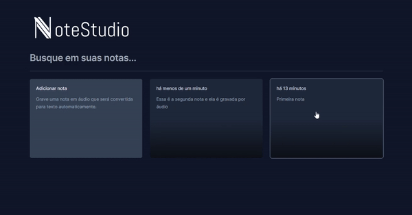
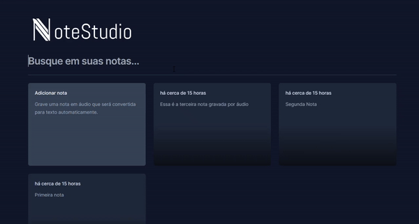

  
  

    O NoteStudio é uma aplicação para gerenciar suas notas de forma eficiente. Ele permite adicionar notas de texto ou áudio, que são convertidas automaticamente em texto para facilitar a organização e busca posterior.
  

## Tabela de conteúdos

- [Tabela de conteúdos](#tabela-de-conteúdos)
- [Funcionalidades](#funcionalidades)
  - [Adicionar notas de texto](#adicionar-notas-de-texto)
  - [Adicionar notas de áudio, que são convertidas em texto](#adicionar-notas-de-áudio-que-são-convertidas-em-texto)
  - [Visualizar e apagar notas existentes](#visualizar-e-apagar-notas-existentes)
  - [Pesquisar notas por palavras-chave](#pesquisar-notas-por-palavras-chave)
- [Tecnologias Utilizadas](#tecnologias-utilizadas)
  - [React](#react)
  - [TypeScript](#typescript)
  - [TailwindCSS](#tailwind-css)
  - [Vite](#vite)
  - [SpeechRecognition](#speechrecognition)
- [Licença](#licença)

## Funcionalidades

- ### Adicionar notas de texto.
  O NoteStudio permite que você adicione facilmente notas de texto para capturar suas ideias, listas de tarefas, e muito mais. Basta clicar no botão "Adicionar Nota" e começar a digitar.
   
   
  

---

- ### Adicionar notas de áudio, que são convertidas em texto.
  Além das notas de texto, o NoteStudio também suporta a adição de notas de áudio. Basta clicar no botão "gravando uma nota", gravar sua mensagem e ela será automaticamente convertida em texto.
   
   
  

---

- ### Visualizar e apagar notas existentes.
  Todas as suas notas são listadas na tela principal, onde você pode visualizá-las e acessá-las facilmente. Além disso, é possível excluir notas que não são mais necessárias.
   
   
  

---

- ### Pesquisar notas por palavras-chave.
  O NoteStudio oferece uma poderosa funcionalidade de pesquisa que permite que você encontre rapidamente notas específicas digitando palavras-chave na barra de pesquisa.
   
   
  

## Tecnologias Utilizadas

Este projeto foi desenvolvido utilizando as seguintes tecnologias:

- ### React:
  > Biblioteca JavaScript para construir interfaces de usuário de forma eficiente e reutilizável. 🚀

- ### TypeScript:
  > Superset tipado de JavaScript que oferece um sistema de tipos estáticos opcional. 🔍

- ### Tailwind CSS:
   > Framework CSS utilitário para construir rapidamente interfaces modernas e responsivas. 🎨

- ### Vite:
   > Build tool rápida e moderna para projetos JavaScript e TypeScript. ⚡️

- ### SpeechRecognition:
  > API de reconhecimento de fala do navegador, para converter áudio em texto em tempo real. 🗣️

## Licença
Este projeto está licenciado sob a Licença MIT. Consulte o arquivo [LICENSE](./LICENSE) para obter mais informações.